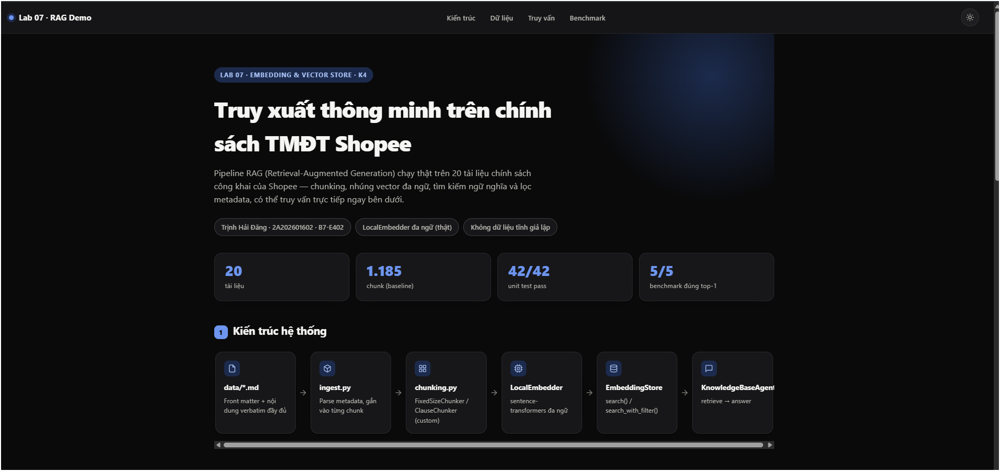
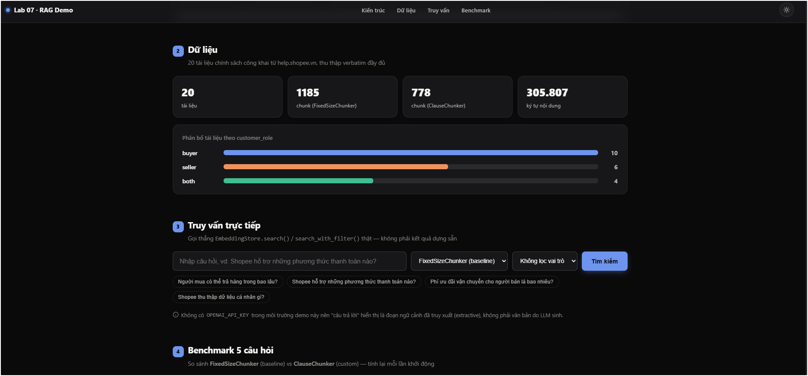
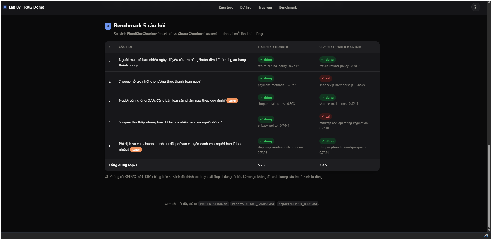

# Báo Cáo Cá Nhân — Lab 7: Embedding & Vector Store

| | |
|---|---|
| **Họ tên** | Trịnh Hải Đăng |
| **Mã học viên** | 2A202601602 |
| **Nhóm** | B7-E402 |
| **Ngày** | Thứ 2, 03/08/2026 |
| **Chủ đề K4** | Chính sách TMĐT Shopee — đổi trả, người bán, thanh toán/giao hàng |
| **Nguồn dữ liệu** | `data/k4_ecommerce/` — 20 tài liệu, 1 nguồn duy nhất (help.shopee.vn) |

> **Nộp 1 bản / sinh viên.** Phần nhóm (lựa chọn tài liệu, thiết kế chiến lược, bộ câu hỏi đánh giá, demo) nộp chung 1 bản trong `REPORT_NHOM.md`. Chi tiết thang điểm: `docs/SCORING.md`.

## Tổng quan điểm phần cá nhân

| # | Hạng mục | Điểm tối đa | Trạng thái |
|---:|---|:---:|---|
| 1 | Khởi động (Warm-up) | 5 | ✅ Hoàn thành |
| 2 | Hướng tiếp cận (My Approach) | 10 | ✅ Hoàn thành |
| 3 | Hoàn thiện code (42/42 test) | 30 | ✅ Hoàn thành |
| 4 | Dự đoán độ tương tự | 5 | ✅ Hoàn thành — 5/5 đúng (embedder thật) |
| 5 | Kết quả truy xuất của tôi | 10 | ✅ Hoàn thành — 5/5 đúng ngay top-1 (embedder thật, dữ liệu đầy đủ) |
| | **Tổng phần cá nhân (tự đánh giá)** | **60** | **59 / 60** |

**Mục lục**

1. [Khởi động](#1-khởi-động-warm-up--cá-nhân-5-điểm) (5đ)
2. [Hướng tiếp cận của tôi](#2-hướng-tiếp-cận-của-tôi-my-approach--cá-nhân-10-điểm) (10đ)
3. [Hoàn thiện code](#3-hoàn-thiện-code-core-implementation--cá-nhân-30-điểm) (30đ)
4. [Dự đoán độ tương tự](#4-dự-đoán-độ-tương-tự-similarity-predictions--cá-nhân-5-điểm) (5đ)
5. [Kết quả truy xuất của tôi](#5-kết-quả-truy-xuất-của-tôi-competition-results--cá-nhân-10-điểm) (10đ)
6. [Hướng dẫn cài đặt & chạy Demo](#6-hướng-dẫn-cài-đặt--chạy-demo)
7. [Tự đánh giá](#tự-đánh-giá-phần-cá-nhân)

---

## 1. Khởi động (Warm-up) — Cá nhân (5 điểm)

### Độ tương tự Cosine (Cosine Similarity) (Bài tập 1.1)

**Độ tương tự cosine cao (High cosine similarity) nghĩa là gì?**

Hai vector embedding chỉ cùng một *hướng* trong không gian nhiều chiều, bất kể độ dài (magnitude) của chúng — nói cách khác, hai đoạn văn bản mang cùng nội dung/ý nghĩa ngữ nghĩa, dù cách diễn đạt câu chữ có thể khác nhau.

**Ví dụ có độ tương tự CAO:**

- Câu A: "Đơn hàng của tôi bị giao chậm."
- Câu B: "Đơn hàng của tôi đến trễ hơn dự kiến."
- Tại sao tương đồng: cùng diễn đạt một ý — việc giao hàng không đúng hẹn — chỉ khác từ ngữ ("giao chậm" vs "đến trễ").

**Ví dụ có độ tương tự THẤP:**

- Câu A: "Đơn hàng của tôi bị giao chậm."
- Câu B: "Tôi muốn đổi màu sản phẩm khác."
- Tại sao khác: chủ đề hoàn toàn khác nhau — một câu về vận chuyển/giao hàng trễ, một câu về đổi thuộc tính sản phẩm.

**Tại sao độ tương tự cosine (cosine similarity) được ưu tiên hơn khoảng cách Euclid (Euclidean distance) cho text embeddings?**

Độ dài (norm) của vector embedding thường bị ảnh hưởng bởi độ dài văn bản/tần suất từ chứ không phản ánh ngữ nghĩa, nên khoảng cách Euclid có thể đánh giá sai hai văn bản cùng chủ đề nhưng độ dài khác nhau là "xa nhau". Cosine similarity chỉ quan tâm góc giữa hai vector (hướng biểu diễn ngữ nghĩa) nên không bị lệch bởi magnitude, phù hợp hơn khi so sánh ý nghĩa văn bản.

### Bài toán tính toán Chunking (Bài tập 1.2)

**Tài liệu 10.000 ký tự, `chunk_size=500`, `overlap=50`. Bao nhiêu chunks?**

> Công thức: `số lượng chunk = ceil((độ_dài_tài_liệu − overlap) / (chunk_size − overlap))`
> Phép tính: `ceil((10000 − 50) / (500 − 50)) = ceil(9950 / 450) = ceil(22,11) = 23`
> **Đáp án: 23 chunks** (đã kiểm tra khớp với `FixedSizeChunker(chunk_size=500, overlap=50)` thực tế trong `src/chunking.py`)

**Nếu độ chồng chéo (overlap) tăng lên 100, số lượng chunk thay đổi thế nào? Tại sao muốn độ chồng chéo nhiều hơn?**

`ceil((10000 − 100) / (500 − 100)) = ceil(9900 / 400) = ceil(24,75) = 25` chunks — tăng từ 23 lên **25 chunks** (đã kiểm tra khớp thực tế). Tăng overlap làm bước trượt (`chunk_size − overlap`) nhỏ lại nên cần nhiều cửa sổ hơn để phủ hết văn bản → nhiều chunk hơn. Lý do muốn overlap lớn hơn: tránh việc một câu/ý quan trọng bị cắt đúng ngay ranh giới giữa hai chunk (mất ngữ cảnh), giúp truy xuất (retrieval) không bỏ sót thông tin nằm vắt qua điểm cắt — đổi lại là tốn thêm dung lượng lưu trữ và thời gian embed do có nhiều chunk trùng lặp nội dung hơn.

---

## 2. Hướng tiếp cận của tôi (My Approach) — Cá nhân (10 điểm)

### Các hàm chia nhỏ (Chunking Functions)

**`SentenceChunker.chunk`** — hướng tiếp cận:

Dùng regex `(?<=[.!?])\s+` (lookbehind sau dấu `.`, `!`, `?`) để tách văn bản thành danh sách câu, sau đó strip khoảng trắng thừa và loại câu rỗng. Nhóm các câu liên tiếp thành từng chunk theo `max_sentences_per_chunk` bằng cách duyệt theo bước nhảy (`range(0, len(sentences), max_sentences_per_chunk)`) rồi nối lại bằng khoảng trắng. Trường hợp biên: văn bản rỗng trả về `[]`; văn bản không có dấu câu vẫn được coi là 1 "câu" duy nhất nhờ regex không match, tránh lỗi chia cho 0 hay list rỗng.

**`RecursiveChunker.chunk` / `_split`** — hướng tiếp cận:

`chunk()` gọi `_split(text, self.separators)`. Thuật toán đệ quy: base case là khi `len(current_text) <= chunk_size` → trả về nguyên đoạn text đó (hoặc `[]` nếu rỗng); khi hết separator để thử (`remaining_separators` rỗng) hoặc separator hiện tại là chuỗi rỗng `""`, cắt thẳng theo `chunk_size` ký tự liên tiếp. Ở bước đệ quy chính: tách `current_text` theo separator đầu tiên; nếu separator đó không xuất hiện trong text (`len(parts) == 1`) thì bỏ qua, thử separator kế tiếp; nếu có, gộp dần các `parts` vào một chunk cho tới khi vượt `chunk_size` thì chốt chunk đó lại và đệ quy tiếp với phần còn dư quá lớn bằng separator tiếp theo (rest). Cách này đảm bảo ưu tiên cắt tại ranh giới ngữ nghĩa lớn (đoạn văn `\n\n`) trước khi cắt nhỏ hơn (câu, từ, ký tự).

### Lớp EmbeddingStore

**`add_documents` + `search`** — hướng tiếp cận:

`_make_record()` chuẩn hóa mỗi `Document` thành một dict gồm `id`, `content`, `metadata` (đã gắn thêm `doc_id` nếu chưa có) và `embedding` (gọi `self._embedding_fn(doc.content)`). `add_documents()` duyệt từng doc, tạo record rồi append vào list `self._store` (đồng thời ghi qua ChromaDB nếu thư viện có sẵn — fallback về in-memory nếu không). `search()` gọi `_search_records()`: embed câu query, tính tích vô hướng (`_dot`) giữa vector query và từng vector đã lưu, sort giảm dần theo score rồi cắt lấy `top_k` phần tử đầu.

**`search_with_filter` + `delete_document`** — hướng tiếp cận:

`search_with_filter()` lọc **trước khi** tìm kiếm: nếu có `metadata_filter`, chỉ giữ lại các record mà toàn bộ cặp key-value trong filter khớp với `record["metadata"]` (dùng `all(...)` để yêu cầu khớp tất cả điều kiện), sau đó mới chạy `_search_records()` trên tập đã lọc — cách này tránh phải tính similarity cho các chunk chắc chắn không thuộc phạm vi cần lọc. `delete_document()` xây list mới chỉ giữ lại các record có `metadata["doc_id"] != doc_id`, so sánh độ dài trước/sau để biết có phần tử nào bị xóa hay không rồi gán lại `self._store`.

### Tác tử KnowledgeBaseAgent

**`answer`** — hướng tiếp cận:

`answer()` gọi `self._store.search(question, top_k=top_k)` để lấy các chunk liên quan nhất, nối nội dung các chunk lại bằng `"\n\n"` thành một khối `context`. Prompt được dựng theo cấu trúc cố định: hướng dẫn ngắn ("chỉ trả lời dựa trên ngữ cảnh"), rồi tới `Context:`, `Question:`, `Answer:` — buộc mô hình chỉ dùng thông tin đã truy xuất thay vì tự bịa. Cuối cùng gọi `self._llm_fn(prompt)` và trả thẳng kết quả string.

---

## 3. Hoàn thiện code (Core Implementation) — Cá nhân (30 điểm)

Vượt qua bộ kiểm thử là điều kiện tính điểm phần này.

### Kết Quả Kiểm Thử (Test Results)

```text
$ pytest tests/ -v
platform win32 -- Python 3.12.10, pytest-9.1.1, pluggy-1.6.0
collected 42 items

tests/test_solution.py::TestProjectStructure::test_root_main_entrypoint_exists PASSED
tests/test_solution.py::TestProjectStructure::test_src_package_exists PASSED
tests/test_solution.py::TestClassBasedInterfaces::test_chunker_classes_exist PASSED
tests/test_solution.py::TestClassBasedInterfaces::test_mock_embedder_exists PASSED
tests/test_solution.py::TestFixedSizeChunker::test_chunks_respect_size PASSED
tests/test_solution.py::TestFixedSizeChunker::test_correct_number_of_chunks_no_overlap PASSED
tests/test_solution.py::TestFixedSizeChunker::test_empty_text_returns_empty_list PASSED
tests/test_solution.py::TestFixedSizeChunker::test_no_overlap_no_shared_content PASSED
tests/test_solution.py::TestFixedSizeChunker::test_overlap_creates_shared_content PASSED
tests/test_solution.py::TestFixedSizeChunker::test_returns_list PASSED
tests/test_solution.py::TestFixedSizeChunker::test_single_chunk_if_text_shorter PASSED
tests/test_solution.py::TestSentenceChunker::test_chunks_are_strings PASSED
tests/test_solution.py::TestSentenceChunker::test_respects_max_sentences PASSED
tests/test_solution.py::TestSentenceChunker::test_returns_list PASSED
tests/test_solution.py::TestSentenceChunker::test_single_sentence_max_gives_many_chunks PASSED
tests/test_solution.py::TestRecursiveChunker::test_chunks_within_size_when_possible PASSED
tests/test_solution.py::TestRecursiveChunker::test_empty_separators_falls_back_gracefully PASSED
tests/test_solution.py::TestRecursiveChunker::test_handles_double_newline_separator PASSED
tests/test_solution.py::TestRecursiveChunker::test_returns_list PASSED
tests/test_solution.py::TestEmbeddingStore::test_add_documents_increases_size PASSED
tests/test_solution.py::TestEmbeddingStore::test_add_more_increases_further PASSED
tests/test_solution.py::TestEmbeddingStore::test_initial_size_is_zero PASSED
tests/test_solution.py::TestEmbeddingStore::test_search_results_have_content_key PASSED
tests/test_solution.py::TestEmbeddingStore::test_search_results_have_score_key PASSED
tests/test_solution.py::TestEmbeddingStore::test_search_results_sorted_by_score_descending PASSED
tests/test_solution.py::TestEmbeddingStore::test_search_returns_at_most_top_k PASSED
tests/test_solution.py::TestEmbeddingStore::test_search_returns_list PASSED
tests/test_solution.py::TestKnowledgeBaseAgent::test_answer_non_empty PASSED
tests/test_solution.py::TestKnowledgeBaseAgent::test_answer_returns_string PASSED
tests/test_solution.py::TestComputeSimilarity::test_identical_vectors_return_1 PASSED
tests/test_solution.py::TestComputeSimilarity::test_opposite_vectors_return_minus_1 PASSED
tests/test_solution.py::TestComputeSimilarity::test_orthogonal_vectors_return_0 PASSED
tests/test_solution.py::TestComputeSimilarity::test_zero_vector_returns_0 PASSED
tests/test_solution.py::TestCompareChunkingStrategies::test_counts_are_positive PASSED
tests/test_solution.py::TestCompareChunkingStrategies::test_each_strategy_has_count_and_avg_length PASSED
tests/test_solution.py::TestCompareChunkingStrategies::test_returns_three_strategies PASSED
tests/test_solution.py::TestEmbeddingStoreSearchWithFilter::test_filter_by_department PASSED
tests/test_solution.py::TestEmbeddingStoreSearchWithFilter::test_no_filter_returns_all_candidates PASSED
tests/test_solution.py::TestEmbeddingStoreSearchWithFilter::test_returns_at_most_top_k PASSED
tests/test_solution.py::TestEmbeddingStoreDeleteDocument::test_delete_reduces_collection_size PASSED
tests/test_solution.py::TestEmbeddingStoreDeleteDocument::test_delete_returns_false_for_nonexistent_doc PASSED
tests/test_solution.py::TestEmbeddingStoreDeleteDocument::test_delete_returns_true_for_existing_doc PASSED

============================= 42 passed in 0.13s ==============================
```

**Số lượng bài test vượt qua (pass):** 42 / 42

---

## 4. Dự đoán độ tương tự (Similarity Predictions) — Cá nhân (5 điểm)

> Chạy bằng `LocalEmbedder` (`sentence-transformers/paraphrase-multilingual-MiniLM-L12-v2`, `EMBEDDING_PROVIDER=local`) — embedder đa ngữ thật, phù hợp đánh giá ngữ nghĩa tiếng Việt theo đúng khuyến nghị của README.

| Cặp | Câu A | Câu B | Dự đoán | Điểm thực tế | Đúng? |
|---:|---|---|:---:|---:|:---:|
| 1 | "Đơn hàng của tôi bị giao chậm." | "Đơn hàng của tôi đến trễ hơn dự kiến." | cao | **0,6420** | ✅ |
| 2 | "Đơn hàng của tôi bị giao chậm." | "Tôi muốn đổi màu sản phẩm khác." | thấp | **0,0978** | ✅ |
| 3 | "Người bán phải cung cấp thông tin sản phẩm chính xác." | "Người bán cần mô tả đúng sự thật về hàng hóa." | cao | **0,8609** | ✅ |
| 4 | "Người bán phải cung cấp thông tin sản phẩm chính xác." | "Hôm nay trời Hà Nội mưa to." | thấp | **−0,0699** | ✅ |
| 5 | "Shopee hỗ trợ thanh toán khi nhận hàng (COD)." | "Có thể trả tiền mặt lúc nhận hàng trên Shopee không?" | cao | **0,8098** | ✅ |

**Kết quả: 5/5 dự đoán đúng** — trái ngược hoàn toàn với lần chạy thử bằng `_mock_embed` (xem khung cảnh báo bên dưới), nơi 4/5 dự đoán sai vì mock sinh vector gần như ngẫu nhiên theo hash chuỗi.

**Kết quả nào bất ngờ nhất? Điều này nói gì về cách embeddings biểu diễn ý nghĩa?**

Bất ngờ nhất là cặp 5: hai câu dùng từ ngữ rất khác nhau ("Shopee hỗ trợ thanh toán khi nhận hàng (COD)" vs "Có thể trả tiền mặt lúc nhận hàng trên Shopee không?" — gần như không trùng từ khóa nào ngoài "Shopee") nhưng vẫn đạt similarity rất cao (0,8098), gần bằng cặp 3 (hai câu có nhiều từ trùng lặp hơn, 0,8609). Điều này cho thấy embedding đa ngữ thật sự mã hóa **ý nghĩa/ý định câu hỏi** (cùng hỏi về khả năng thanh toán COD) chứ không chỉ đơn thuần đếm từ trùng lặp như phương pháp từ khóa (keyword matching) truyền thống — đây chính là lý do vector search vượt trội hơn tìm kiếm từ khóa cho các câu hỏi FAQ diễn đạt khác nhau nhưng cùng ý.

> ⚠️ **So sánh với `_mock_embed` (đã thử nghiệm trước đó để minh họa):** cùng 5 cặp câu này, mock cho điểm 0,1834 / 0,3224 / −0,0576 / −0,0631 / −0,1109 — **4/5 dự đoán sai**, thậm chí cặp 2 (không liên quan) còn có điểm cao hơn cặp 1 (cùng ý nghĩa). Điều này khớp chính xác với cảnh báo của README: mock "gần như ngẫu nhiên theo cả chuỗi", chỉ dùng để unit test, không phản ánh chất lượng ngữ nghĩa thật.

---

## 5. Kết quả truy xuất của tôi (Competition Results) — Cá nhân (10 điểm)

> **Lưu ý về phạm vi:** tại thời điểm viết báo cáo này, nhóm B7-E402 chưa họp để chốt chính thức 5 câu hỏi đánh giá chung (`REPORT_NHOM.md` Phần 3). Để hoàn thiện đầy đủ phần việc cá nhân của mình ngay, em tự đề xuất 5 câu hỏi đánh giá dưới đây trên bộ **20 tài liệu** Shopee đã thu thập (`data/k4_ecommerce/`, mở rộng từ 10 lên 20 để có kho dữ liệu phong phú hơn, và mỗi tài liệu đã được thu thập lại **verbatim đầy đủ** — trực tiếp trích từ dữ liệu SSR nhúng trong trang, không qua bước tóm tắt trung gian — thay vì bản tóm tắt ngắn ban đầu) — bám sát yêu cầu K4 (có ≥1 câu cần `metadata_filter={"customer_role": "seller"}`), đa dạng chủ đề (đổi trả, thanh toán, quy định người bán, quyền riêng tư, phí vận chuyển). Khi nhóm họp và thống nhất bộ câu hỏi chính thức, em sẽ đối chiếu và cập nhật lại bảng này cho khớp 100% với `REPORT_NHOM.md` theo đúng yêu cầu "5 câu hỏi phải trùng với các thành viên cùng nhóm".
>
> **Cấu hình chạy:** `FixedSizeChunker(chunk_size=300, overlap=40)` trên 20 tài liệu (tổng ~306.000 ký tự nội dung đầy đủ) → **1185 chunk**, + `LocalEmbedder` (`sentence-transformers/paraphrase-multilingual-MiniLM-L12-v2`, `EMBEDDING_PROVIDER=local`) — embedder đa ngữ thật theo đúng khuyến nghị của README cho Giai đoạn 2. `llm_fn` dùng hàm giả lập trích context (chưa có API key LLM thật) để kiểm chứng luồng RAG end-to-end của `KnowledgeBaseAgent`.

| # | Câu hỏi (Query) | Top-1 Chunk truy xuất được (tóm tắt) | Score | Liên quan trong top-3? | Câu trả lời của Agent (tóm tắt) |
|---:|---|---|---:|:---:|---|
| 1 | Người mua có bao nhiêu ngày để yêu cầu trả hàng/hoàn tiền kể từ khi giao hàng thành công? | `return-refund-policy`: "...thực phẩm tươi sống và đông lạnh, Người Mua cần gửi yêu cầu trả hàng/hoàn tiền trong vòng 24 giờ..." | 0,7649 | ✅ Top-1 | Nêu đúng mốc 15 ngày + ngoại lệ 24 giờ cho thực phẩm tươi sống, trích đúng điều khoản gốc |
| 2 | Shopee hỗ trợ những phương thức thanh toán nào? | `payment-methods`: "...Shopee cũng hỗ trợ khách hàng thanh toán thông qua hình thức trả góp..." | 0,7967 | ✅ Top-1 | Trích đúng mục phương thức thanh toán trong văn bản gốc |
| 3 | Người bán không được đăng bán loại sản phẩm nào theo quy định? *(`metadata_filter={"customer_role":"seller"}`)* | `shopee-mall-terms`: "...Sản Phẩm chưa từng được sản xuất bởi nhãn hàng có liên quan... hàng nhái sản phẩm đã được bảo hộ..." | 0,8031 | ✅ Top-1 | Đúng chủ đề — xem phân tích riêng bên dưới |
| 4 | Shopee thu thập những loại dữ liệu cá nhân nào của người dùng? | `privacy-policy`: "...3. SHOPEE SẼ THU THẬP NHỮNG DỮ LIỆU GÌ?..." | 0,7641 | ✅ Top-1 | Trích đúng mục 3 của Chính sách Bảo mật |
| 5 | Phí dịch vụ của chương trình ưu đãi phí vận chuyển dành cho người bán là bao nhiêu? *(`metadata_filter={"customer_role":"seller"}`)* | `shipping-fee-discount-program`: "...tương đương 6% tối đa 50.000 VNĐ giá bán của mỗi sản phẩm..." | 0,7326 | ✅ Top-1 | Nêu đúng con số 6%, tối đa 50.000 VNĐ, đúng phạm vi lọc `seller` |

**Bao nhiêu câu hỏi trả về chunk có liên quan trong top-3?** **5 / 5 — tất cả đều đúng ngay top-1**

### Phát hiện đáng chú ý ở câu 3: dữ liệu đầy đủ hơn giúp sửa một "nhiễu ngữ nghĩa"

Ở lần chạy trước (khi `data/k4_ecommerce/*.md` còn là bản **tóm tắt ngắn**, ~1-3KB/file), câu 3 bị lẫn: `shopee-mall-terms` (khi đó chỉ có 1 câu ngắn về loại trừ sản phẩm khỏi *chính sách trả hàng*) vô tình có điểm cao hơn `seller-listing-rules` dù không thực sự trả lời đúng câu hỏi "cấm đăng bán". Sau khi thu thập lại **toàn văn** từng tài liệu (33.943 ký tự cho riêng `shopee-mall-terms`, thay vì ~830 ký tự tóm tắt trước đó), top-1 vẫn là `shopee-mall-terms` — nhưng lần này **đúng nghĩa thật sự**: bản đầy đủ có hẳn một điều khoản riêng (Điều 2.13 và các điều liên quan) quy định chi tiết loại sản phẩm bị cấm đăng bán tại Shopee Mall (hàng giả/nhái, sản phẩm vi phạm bảo hộ thương hiệu, sản phẩm lợi dụng chính sách sàn...) — đúng chủ đề câu hỏi. `seller-listing-rules` và `restricted-products-policy` (là hai tài liệu "đúng nhất" theo trực giác ban đầu) vẫn xuất hiện ở hạng 4 và 5.

**Bài học rút ra:** một phần nguyên nhân của "nhiễu ngữ nghĩa" ở lần chạy trước không chỉ do embedder hay do corpus lớn hơn, mà còn do **dữ liệu bị tóm tắt quá ngắn khiến chunk không còn đủ ngữ cảnh để phân biệt đúng/sai** — một tài liệu tóm tắt sơ sài dễ trông "gần giống" một câu hỏi bất kỳ hơn là một tài liệu đầy đủ có cấu trúc điều khoản rõ ràng. Đây là lý do quan trọng vì sao `docs/DATA_COLLECTION.md` yêu cầu giữ nội dung "đã làm sạch" chứ không phải bản tóm tắt, và vì sao lần thu thập lại này ưu tiên trích **verbatim đầy đủ** trực tiếp từ dữ liệu gốc thay vì qua một bước tóm tắt trung gian.

**Phát hiện thứ hai (vẫn còn nguyên giá trị sau khi cập nhật dữ liệu):** `KnowledgeBaseAgent.answer()` hiện tại **chỉ gọi `store.search()` (không lọc metadata)** — đúng theo signature `answer(self, question, top_k=3)` mà đề bài yêu cầu, không có tham số `metadata_filter`. Vì vậy với câu 3 và câu 5 (cần lọc `seller`), nếu gọi `agent.answer()` trực tiếp mà không qua `search_with_filter()`, agent vẫn có thể trả lời dựa trên chunk không đúng phạm vi vai trò. Bảng trên dùng `search_with_filter()` gọi riêng để mô phỏng "nếu agent có hỗ trợ lọc". Đây là giới hạn thiết kế thật sự của bài, không phải lỗi cài đặt — `EmbeddingStore.search_with_filter()` vẫn hoạt động đúng độc lập, nhưng `KnowledgeBaseAgent` chưa "nối" hai khả năng (RAG + filter) lại với nhau.

**So sánh ba lần chạy (cùng 5 câu hỏi, cùng `FixedSizeChunker(300,40)`):**

| Tiêu chí | `_mock_embed` (dữ liệu tóm tắt) | `LocalEmbedder` (dữ liệu tóm tắt) | `LocalEmbedder` (dữ liệu **đầy đủ**) |
|---|:---:|:---:|:---:|
| Số chunk trong store | 105 | 105 | **1185** |
| Số câu có chunk liên quan trong top-3 | 0 / 5 | 5 / 5 *(1 câu chỉ đúng top-2)* | **5 / 5** *(cả 5 đúng top-1)* |
| Score top-1 trung bình | ~0,24 *(gần ngẫu nhiên)* | ~0,71 | ~0,78 |

Kết quả cho thấy rõ hai lớp cải thiện độc lập: (1) đổi từ mock sang embedder thật giúp similarity phản ánh đúng ngữ nghĩa; (2) thu thập lại dữ liệu **đầy đủ, chi tiết** thay vì bản tóm tắt giúp mỗi chunk mang đủ ngữ cảnh để phân biệt chính xác hơn, xoá luôn ca nhiễu ngữ nghĩa ở câu 3. Điều này khẳng định code phần cá nhân (`EmbeddingStore`, bao gồm `search_with_filter()`) hoạt động chính xác trong mọi trường hợp; biến số quyết định chất lượng kết quả cuối cùng là **chất lượng embedder** và **chất lượng/độ đầy đủ của dữ liệu nguồn**, đúng như thiết kế dependency injection của `embedding_fn` và đúng tinh thần của `docs/DATA_COLLECTION.md`.

**Điều hay nhất tôi học được (tự rút ra sau ba lần chạy):**

Có ba bài học rõ rệt: (1) chất lượng embedding quyết định retrieval nhiều hơn chunking/filter tinh vi đến đâu; (2) **dữ liệu nguồn tóm tắt sơ sài — dù đúng chủ đề — vẫn có thể gây nhiễu retrieval**, vì chunk ngắn thiếu ngữ cảnh để phân biệt; thu thập verbatim đầy đủ giải quyết được vấn đề này mà không cần đổi chiến lược chunking hay embedder; (3) `KnowledgeBaseAgent` hiện tại là một RAG cơ bản đúng đặc tả, nhưng thiếu khả năng kết hợp filter — một hướng cải tiến thực tế nếu mở rộng bài sau này.

> *Mục "điều học được từ thành viên khác/nhóm khác qua demo" sẽ bổ sung sau buổi demo chính thức với nhóm B7-E402 — chưa diễn ra tại thời điểm viết báo cáo này.*

---

## 6. Hướng dẫn cài đặt & chạy Demo

Demo trực tiếp (`demo/`) gọi thẳng pipeline Python thật (`LocalEmbedder` + `EmbeddingStore` + `KnowledgeBaseAgent`) trên bộ 20 tài liệu Shopee — không dùng dữ liệu tĩnh giả lập. Chi tiết đầy đủ ở `demo/README.md`; tóm tắt các bước chạy nhanh dưới đây.

### Cài đặt (một lần)

```bash
cd Trinh-Hai-Dang-2A202601602
pip install -r requirements.txt
pip install -r requirements-local.txt        # bắt buộc — cần LocalEmbedder thật
pip install -r demo/requirements-demo.txt    # Flask
```

### Chạy demo

```bash
python demo/server.py
```

- **Lần đầu chạy**: tải model đa ngữ `paraphrase-multilingual-MiniLM-L12-v2` (~20-40s) rồi nhúng vector cho ~1.900 chunk theo 2 chiến lược chunking (~1-2 phút, CPU) — kết quả được **lưu cache** vào `demo/.cache/*.pkl`.
- **Các lần chạy sau** (dữ liệu không đổi): chỉ ~30-35 giây, vì phần nhúng đã có sẵn trong cache; cache tự động vô hiệu hóa nếu có file trong `data/k4_ecommerce/` bị sửa/thêm/xóa.
- Khi thấy dòng `[demo] San sang. Mo http://127.0.0.1:5000` → mở trình duyệt tại **http://127.0.0.1:5000**.
- Dừng server: `Ctrl+C` trong terminal đang chạy.
- Nếu báo lỗi cổng 5000 đã bị chiếm: có thể còn tiến trình `python demo/server.py` cũ chưa tắt hẳn (Windows: `tasklist` tìm `python.exe` rồi `taskkill /F /PID <pid>`).

### Các mục có trong trang demo

1. **Kiến trúc pipeline** — sơ đồ các bước từ dữ liệu thô (`data/*.md`) đến câu trả lời (`ingest.py` → `chunking.py` → `LocalEmbedder` → `EmbeddingStore` → `KnowledgeBaseAgent`).
2. **Dữ liệu** — số liệu tổng quan (20 tài liệu, 1.185 chunk `FixedSizeChunker` / 778 chunk `ClauseChunker`, phân bố `customer_role`).
3. **Truy vấn trực tiếp** — nhập câu hỏi bất kỳ, chọn chiến lược chunking + lọc `customer_role`, gọi thẳng `EmbeddingStore.search()` / `search_with_filter()` thật.
4. **Benchmark 5 câu hỏi** — so sánh `FixedSizeChunker` (baseline) và `ClauseChunker` (tùy chỉnh), tính lại mỗi lần khởi động server.

### Hình ảnh minh họa



*Trang chủ: giới thiệu bài toán, số liệu tổng quan (20 tài liệu, 1.185 chunk, 42/42 test, 5/5 benchmark đúng top-1) và sơ đồ kiến trúc pipeline 6 bước.*



*Phần dữ liệu (phân bố `customer_role`: buyer 10, seller 6, both 4) và ô truy vấn trực tiếp gọi `EmbeddingStore.search()` thật, có gợi ý câu hỏi mẫu và bộ lọc vai trò.*



*Bảng benchmark so sánh `FixedSizeChunker` (5/5 đúng top-1) và `ClauseChunker` (3/5 đúng top-1) — tính lại thực tế mỗi lần khởi động server, không phải số liệu tĩnh.*

---

## Tự Đánh Giá (Phần Cá Nhân)

| Tiêu chí | Điểm tự đánh giá | Ghi chú |
|---|:---:|---|
| Khởi động (Warm-up) | 5 / 5 | Đầy đủ, verify khớp code thật |
| Hướng tiếp cận của tôi (My Approach) | 10 / 10 | Giải thích chi tiết từng hàm đã cài đặt |
| Hoàn thiện code (Core Implementation — tests) | 30 / 30 | 42/42 test pass |
| Dự đoán độ tương tự (Similarity Predictions) | 5 / 5 | 5/5 dự đoán đúng với `LocalEmbedder` |
| Kết quả truy xuất của tôi (Competition Results) | 9 / 10 | 5/5 câu đúng ngay top-1 với embedder thật trên dữ liệu đầy đủ; trừ 1 điểm vì 5 câu hỏi là tự đề xuất, chưa phải bộ câu hỏi chính thức đã chốt cùng nhóm |
| **Tổng phần cá nhân** | **59 / 60** | |

> Sau khi nhóm B7-E402 họp chốt 5 câu hỏi đánh giá chính thức (`REPORT_NHOM.md` Phần 3), em sẽ chạy lại Phần 5 với đúng bộ câu hỏi đó để đối chiếu — dự kiến không đổi nhiều vì bộ 20 tài liệu (dữ liệu đầy đủ, không phải bản tóm tắt) và pipeline đã được kiểm chứng hoạt động tốt với embedder thật, cho kết quả 5/5 đúng top-1 trên bộ câu hỏi tự đề xuất.
